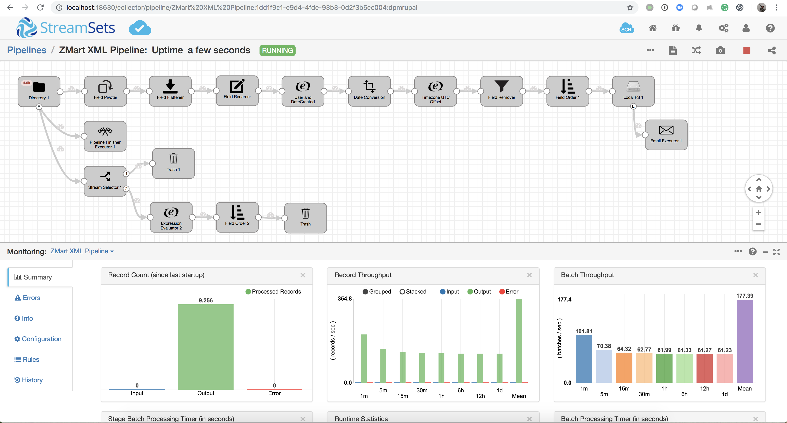
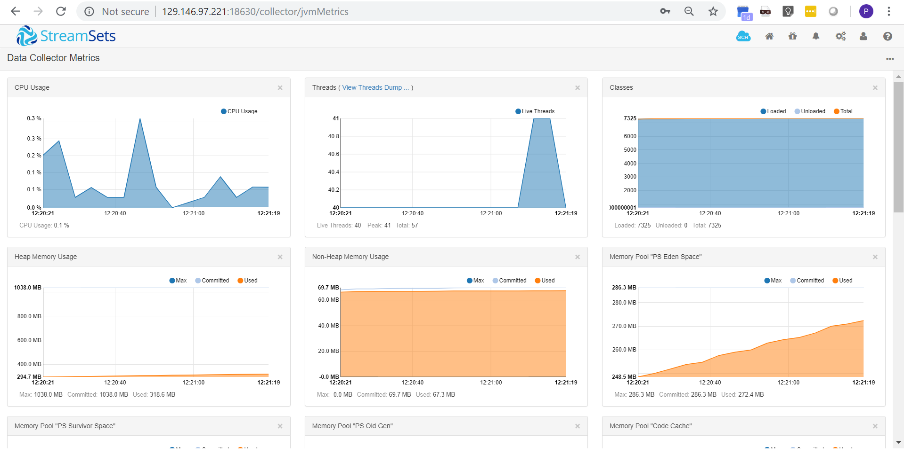
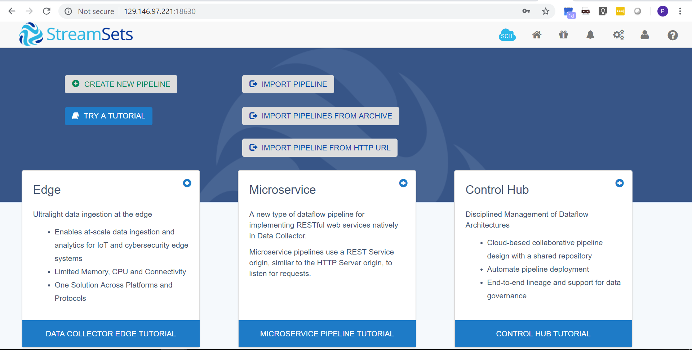

Data Collector Web Console 

## PREREQUISITES
1. Make sure Terraform has been installed and configured. 
2. Edit "env-vars" file with the appropriate values from your OCI account & tenancy information.
3. Source the "env-vars" file using the command: "source env-vars"
4. Deploy using standard terraform commands: "terraform init && terraform plan && terraform apply"

			
						 Getting Started

Welcome! In this repository are the Terraform scripts that will preform the setup of the StreamSets Data Collector (SDC) to ingest data rapidly and easily. In the the current level of this directory are the Terraform files that create a single compute instance running one data collector. This is commonly used for learning or developing on the StreamSets Data Operations Platform. However, it can be used for production ready data movement and transformation.

The folder titled, "SDC Standalone with EDH Cluster", will create single SDC instance ready for data movement inside a Cloudera Enterprise Data Hub. This SDC instance will reside in the same subnet(s) as the worker nodes in the cluster. This is mainly for easy development and learning how the StreamSets Data Operations Platform extends to Hadoop infrastructure.

The folder titled, "SDC via CDH Parcel Manager", will create SDC instances on all the worker nodes in the cluster and enable things like clustered execution of pipelines or REST-based microservices pipelines. This is not currently production ready and is still in development but stay tuned!
						
					What is the StreamSets Data Collector?
StreamSets Data Collector is a lightweight, powerful design and execution engine that streams data in real time. SDC is used to route and process data in your data streams from almost any origin to almost any source.

To define the flow of data, you design a pipeline in SDC. A pipeline consists of one or more stages that represents the origin(s) and destination of the pipeline, as well as any additional processing that you want to perform. After you design the pipeline, you can preview it to assist with debugging.  When ready to run the pipeline live, you click Start and the SDC goes to work.

Once SDC is running, it processes the data when it arrives at the origin and waits quietly when not needed. You can view real-time statistics about your data, inspect data as it passes through the pipeline, or take a closer look at a snapshot of data.

					How should I use SDC?
Use SDC like a pipe for a data stream. Throughout your enterprise data topology, you have streams of data that you need to move, collect, and process on the way to their destinations. SDC provides the crucial connection between hops in the stream.

To solve your ingest needs, you can use a single SDC to run one or more pipelines. Or you might install a series of Data Collectors to stream data across your enterprise data topology.

					How does this really work?
Let's walk through it...

After you run the terraform script for a standalone SDC, you use the Data Collector UI to log in and create your first pipeline.

What do you want it to do? Let's say you want to read XML files from a directory and remove the newline characters before moving it into HDFS. To do this, you start with a Directory origin stage and configure it to point to the source file directory. (You can also have the stage archive processed files and write files that were not fully processed to a separate directory for review.)

To remove the newline characters, connect Directory to an Expression Evaluator processor and configure it to remove the newline character from the last field in the record.

To make the data available to HDFS, you connect the Expression Evaluator to a Hadoop FS destination stage. You configure the stage to write the data as a JSON object (though you can use other data formats as well).

You preview data to see how source data moves through the pipeline and notice that some fields have missing data. So you add a Field Replacer to replace null values in those fields.

Now that the data flow is done, you configure the pipeline error record handling to write error records to a file, you create a data drift alert to let you know when field names change, and you configure an email alert to let you know when the pipeline generates more than 100 error records. Then, you start the pipeline and Data Collector goes to work.

The Data Collector goes into Monitor mode and displays summary and error statistics immediately. To get a closer look at the activity, you take a snapshot of the pipeline so you can examine how a set of data passed through the pipeline. You see some unexpected data in the pipeline, so you create a data rule for a link between two stages to gather information about similar data and set an alert to notify you when the numbers get too high.

And what about those error records being written to file? They're saved with error details, so you can create an error pipeline to reprocess that data. Et voila!

StreamSets Data Collector is a powerful tool, but we're making it as simple as possible to use. So give it a try, click the Help icon for information, and contact us if you need a hand. For more use cases or examples to learn on, please visit: https://github.com/streamsets/tutorials

